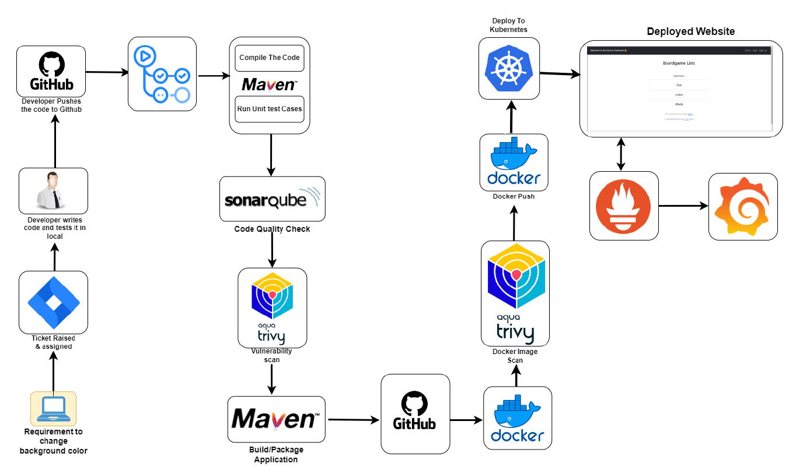
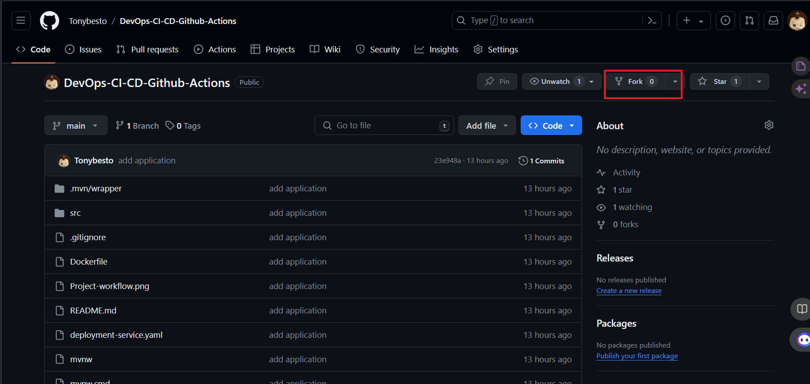

##  Project Documentation and Steps Taken to Implement



### PHASE-1 | Setup Repo Fork the Repo


1. Navigate to the Repository: Go to the repository you want to fork. This can be done through the platform's search feature or by directly accessing the repository's URL.
   
2. Locate the Fork Button: Look for the "Fork" button on the repository's page. This button is usually located in the top-right corner of the page. Click on it.
   
3. Choose the Destination: When you click on the "Fork" button, you'll be prompted to choose where you want to fork the repository. This is typically your personal account or an organization you belong to. Select the appropriate destination.

4. Wait for the Fork to Complete: The platform will start the forking process, creating a copy of the repository under your account. Depending on the size of the repository, this process may take a few moments.



### PHASE-2 | Infra Setup Setting Up Kubernetes Cluster on AWS EC2 

1. Instances 1. Creating VMs:

• Log in to the AWS Management Console.

• Navigate to the EC2 dashboard.

• Click on "Launch Instance".

• Choose an Amazon Machine Image (AMI), select the appropriate instance type (t2.medium), configure instance details, add storage (20GB), and configure security groups to allow SSH access.

• Repeat the above steps to create the second VM. 

2. Connecting to VMs via SSH(using Mobaexterm or any other Terminal):

• Use an SSH client like mobaxterm (for Windows) or Terminal (for macOS/Linux) to connect to the VMs using their public IP addresses and SSH key pair. 

3. **Updating Packages:**
```   
sudo apt update && sudo apt upgrade -y 
```
4. Create and Execute Script on Both Master & Worker VM:

Script (setup.sh):
```
sudo apt install docker.io -y
sudo chmod 666 /var/run/docker.sock
sudo apt-get install -y apt-transport-https ca-certificates curl gnupg
sudo mkdir -p -m 755 /etc/apt/keyrings
curl -fsSL https://pkgs.k8s.io/core:/stable:/v1.28/deb/Release.key | sudo gpg --dearmor -o /etc/apt/keyrings/kubernetes-apt-keyring.gpg
echo 'deb [signed-by=/etc/apt/keyrings/kubernetes-apt-keyring.gpg] https://pkgs.k8s.io/core:/stable:/v1.28/deb/ /' | sudo tee /etc/apt/sources.list.d/kubernetes.list
sudo apt update
sudo apt install -y kubeadm=1.28.1-1.1 kubelet=1.28.1-1.1 kubectl=1.28.1-1.1
```
Execution:
```
sudo chmod +x setup.sh
sudo ./setup.sh
```

5. On Master Node: 
 
Script (init_master.sh):
```
sudo kubeadm init --pod-network-cidr=10.244.0.0/16
mkdir -p $HOME/.kube
sudo cp -i /etc/kubernetes/admin.conf $HOME/.kube/config
sudo chown $(id -u):$(id -g) $HOME/.kube/config
kubectl apply -f https://docs.projectcalico.org/manifests/calico.yaml
kubectl apply -f https://raw.githubusercontent.com/kubernetes/ingress-nginx/controller-v0.49.0/deploy/static/provider/baremetal/deploy.yaml 
```
Execution:
```
sudo chmod +x init_master.sh
sudo ./init_master.sh
```

6. On Worker Node:
   
• Copy the kubeadm join command provided in the output of kubeadm init from the master node.

• Execute the command on the worker node as the root user. 

7. Verification:

• On the master node, run:

```
kubectl get nodes
kubectl get pods --all-namespaces
```
• Ensure all nodes are in the Ready state and pods are running.


Create Service Account, Role & Assign that role, And create a secret for Service Account and genrate a Token Creating Service Account

```
---
apiVersion: v1
kind: ServiceAccount
metadata: null
name: jenkins
namespace: webapps Create Role

---
apiVersion: rbac.authorization.k8s.io/v1
kind: Role
metadata: null
name: app-role
namespace: webapps
rules:
  - apiGroups: null
  - ""
  - apps
  - autoscaling
  - batch
  - extensions
  - policy
  - rbac.authorization.k8s.io
resources:
  - pods
  - componentstatuses
  - configmaps
  - daemonsets
  - deployments
  - events
  - endpoints
  - horizontalpodautoscalers
  - ingress
  - jobs
  - limitranges
  - namespaces
  - nodes
  - pods
  - persistentvolumes
  - persistentvolumeclaims
  - resourcequotas
  - replicasets
  - replicationcontrollers
  - serviceaccounts
  - services
verbs:
  - get
  - list
  - watch
  - create
  - update
  - patch
  - delete
```

#### Bind the role to service account

```
apiVersion: rbac.authorization.k8s.io/v1
kind: RoleBinding
metadata:
  name: app-rolebinding 
  namespace: webapps
roleRef:
  apiGroup: rbac.authorization.k8s.io
  kind: Role
  name: app-role
subjects:
- namespace: webapps
  kind: ServiceAccount
  name: jenkins
```
Generate token using service account in the namespace

[create token](https://kubernetes.io/docs/reference/access-authn-authz/service-accounts-admin/#:~:text=To%20create%20a%20non%2Dexpiring,with%20that%20generated%20token%20data.)


### SetUp SonarQube
```
sudo apt-get update
sudo apt-get install -y ca-certificates curl
sudo install -m 0755 -d /etc/apt/keyrings
sudo curl -fsSL https://download.docker.com/linux/ubuntu/gpg -o /etc/apt/keyrings/docker.asc
sudo chmod a+r /etc/apt/keyrings/docker.asc
echo "deb [arch=$(dpkg --print-architecture) signed-by=/etc/apt/keyrings/docker.asc] https://download.docker.com/linux/ubuntu \
$(. /etc/os-release && echo "$VERSION_CODENAME") stable" | \
sudo tee /etc/apt/sources.list.d/docker.list > /dev/null
sudo apt-get update
sudo apt-get install -y docker-ce docker-ce-cli containerd.io docker-buildx-plugin docker-compose-plugin 
```

Save this script in a file, for example, install_docker.sh, and make it executable using:

```
sudo chmod +x install_docker.sh
````
Then, you can run the script using:

```
./install_docker.sh
```


Create Sonarqube Docker container To run SonarQube in a Docker container with the provided command, you can follow these steps:

1. Open your terminal or command prompt.
   
2. Run the following command:
```   
docker run -d --name sonar -p 9000:9000 sonarqube:lts-community 
```
This command will download the sonarqube:lts-community Docker image from Docker Hub if it's not already available locally. Then, it will create a container named "sonar" from this image, running it in detached mode (-d flag) and mapping port 9000 on the host machine to port 9000 in the container (-p 9000:9000 flag).

3. Access SonarQube by opening a web browser and navigating to http://VmIP:9000. 
   
  This will start the SonarQube server, and you should be able to access it using the provided URL. If you're running Docker on a remote server or a different port, replace localhost with the appropriate hostname or IP address and adjust the port accordingly.


### Setting Up GitHub Actions Self-hosted Runner on VM

1. Provisioning VM:
   
• Log in to your cloud provider (e.g., AWS, Azure, GCP).

• Navigate to the dashboard or console for managing virtual machines.

• Click on "Launch Instance" or similar to create a new virtual machine.

• Choose an appropriate instance type (t2.large), configure instance details (8GB RAM, 20GB storage), networking, and security settings.

• Complete the setup and wait for the VM to be provisioned. 

2. Accessing VM:
   
• Once the VM is provisioned, obtain its public IP address or DNS name.

• Use SSH (for Linux) or RDP (for Windows) to connect to the VM.

3. Setting Up Self-hosted Runner:
   
• Open a terminal or command prompt on the VM. 

4. Registering Runner:

• Go to your GitHub repository where you want to set up the self-hosted runner.

• Navigate to the "Settings" tab. 

5. Accessing Runner Configuration:

• On the left sidebar, click on "Actions".

• Click on "Runners". 

6. Adding New Runner:

• Click on "New self-hosted runner". 

7. Selecting Machine Type:
   
• Choose the appropriate machine type (Linux, macOS, Windows) based on your VM's operating system. 

8. Executing Commands:

• Follow the instructions provided by GitHub to download and configure the runner. These typically involve running a set of commands. 

9. Starting the Runner:

• After configuring the runner, start it by running the command provided.


### PHASE-3 | CICD 

#### Java CI Pipeline with GitHub Actions 

This document outlines the steps to create a continuous integration (CI) pipeline using GitHub Actions for a Java project built with Maven. The pipeline includes steps for building the project, running security scans, performing code quality analysis with SonarQube, building and scanning Docker images, and deploying to Kubernetes. Secrets are used to securely store sensitive information such as authentication tokens and configuration files. 

**Pipeline Overview:**

1. Java Build and Package:
   
o Sets up JDK 17 using Temurin distribution.

o Builds the Java project using Maven.

o Uploads the generated JAR artifact as a GitHub Action artifact.

2. Security Scans:
   
o Performs file system scan using Trivy.

o Runs SonarQube scan for code quality analysis.

3. Docker Build and Scan:
   
o Sets up QEMU and Docker Buildx.

o Builds Docker image for the Java application.

o Scans Docker image using Trivy.

o Logs in to Docker Hub using provided credentials.

o Pushes the Docker image to Docker Hub.

4. Kubernetes Deployment:
   
o Uses Kubectl Action to interact with Kubernetes cluster.

o Applies deployment and service configuration from deployment-service.yaml file to deploy the application to Kubernetes namespace webapps.


Pipeline Configuration:

```
name: CICD By Tony
on:
  push:
    branches: [ "main" ]

jobs:
  build:
    runs-on: self-hosted

    steps:
      - uses: actions/checkout@v3

      - name: Set up JDK 17
        uses: actions/setup-java@v3
        with:
          java-version: '17' 
          distribution: 'temurin'
          cache: maven

      - name: Build with Maven
        run: mvn package

      - uses: actions/upload-artifact@v4
        with:
          name: my-artifact
          path: target/*.jar

      - name: Trivy FS Scan
        run: |
          trivy fs --format table -o trivy-fs-report.html .

      - name: SonarQube Scan
        uses: sonarsource/sonarqube-scan-action@master
        env:
          SONAR_TOKEN: ${{ secrets.SONAR_TOKEN }}
          SONAR_HOST_URL: ${{ secrets.SONAR_HOST_URL }}

      - name: Install jq
        run: sudo apt-get update && sudo apt-get install -y jq

      - name: SonarQube Quality Gate check
        id: sonarqube-quality-gate-check
        uses: sonarsource/sonarqube-quality-gate-action@master
        timeout-minutes: 5
        env:
          SONAR_TOKEN: ${{ secrets.SONAR_TOKEN }}
          SONAR_HOST_URL: ${{ secrets.SONAR_HOST_URL }}

      - name: Set up QEMU
        uses: docker/setup-qemu-action@v3

      - name: Set up Docker Buildx 
        uses: docker/setup-buildx-action@v3

      - name: Build Docker Image
        run: |
          docker build -t adijaiswal/boardgame:latest .

      - name: Trivy Image Scan
        run: |
          trivy image --format table -o trivy-image-report.html adijaiswal/board:latest

      - name: Login to Docker Hub
        uses: docker/login-action@v3
        with:
          username: ${{ secrets.DOCKERHUB_USERNAME }}
          password: ${{ secrets.DOCKERHUB_TOKEN }}  

      - name: Push Docker Image
        run: |
          docker push adijaiswal/boardgame:latest

```

#### Secrets Configuration: 

Ensure that the following secrets are configured in your GitHub repository:

• SONAR_TOKEN: Token for authenticating SonarQube scan.

• SONAR_HOST_URL: URL of your SonarQube instance.

• DOCKERHUB_USERNAME: Username for Docker Hub authentication.

• DOCKERHUB_TOKEN: Token for Docker Hub authentication.

• KUBE_CONFIG: Base64 encoded Kubernetes configuration file (kubeconfig) for accessing the Kubernetes cluster.


### PHASE-4 | Monitoring 

Downloading Prometheus Components and Grafana Below are the steps to download Prometheus components (Node Exporter, Blackbox Exporter, and Prometheus itself) from the official Prometheus website and Grafana from the Grafana website: 

**1. Downloading Node Exporter:**
   
• Go to the Prometheus download page: [Prometheus Download Page](https://prometheus.io/download/).

• Scroll down to the "Node Exporter" section.

• Choose the appropriate version for your operating system.

• Click on the download link to download the Node Exporter binary. 

**2. Downloading Blackbox Exporter:**

• Go to the Prometheus download page: [Prometheus Download Page](https://prometheus.io/download/).

• Scroll down to the "Blackbox Exporter" section.

• Choose the appropriate version for your operating system.

• Click on the download link to download the Blackbox Exporter binary. 

**3. Downloading Prometheus:**

• Go to the Prometheus download page: [Prometheus Download Page](https://prometheus.io/download/).

• Scroll down to the "Prometheus" section.

• Choose the appropriate version for your operating system.

• Click on the download link to download the Prometheus binary. 

**4. Downloading Grafana:**

• Go to the Grafana download page: [Grafana Download Page](https://grafana.com/grafana/download).

• Choose the appropriate version for your operating system.

• Click on the download link to download the Grafana binary.